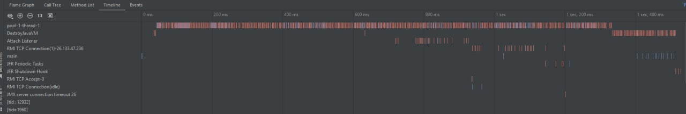
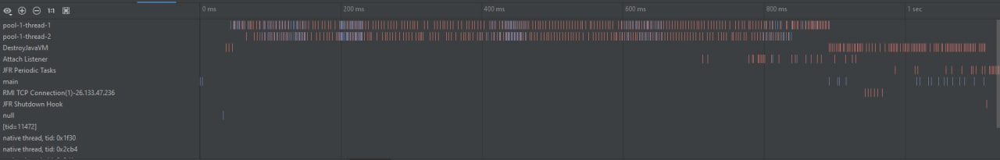
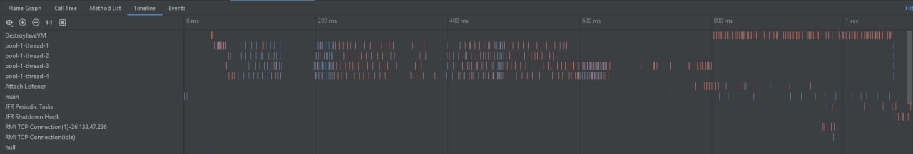
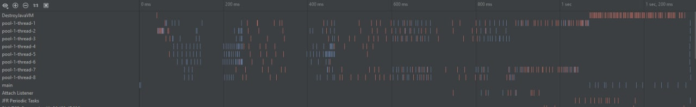
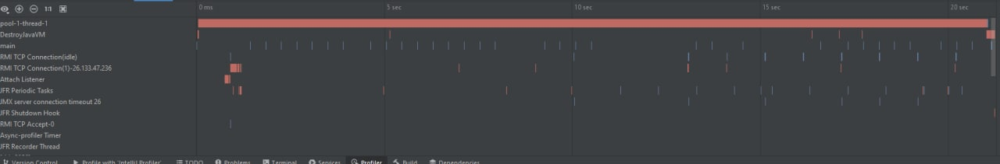
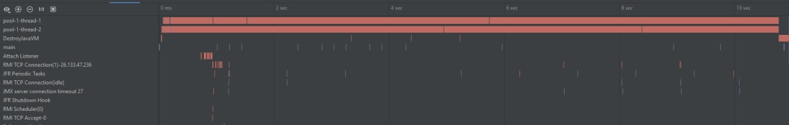
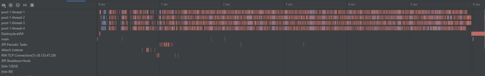
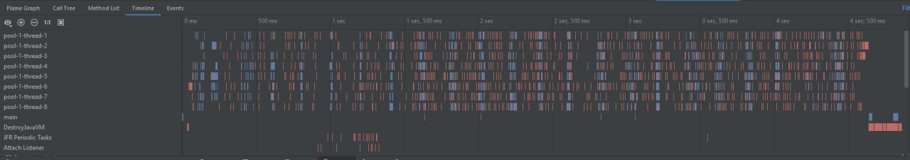

# Parallel statistics

In the folder fines, we have one file with data - fine2001.json with a size of 30 Mb but  
try to emulate bigger data using a loop where we are reading the file n times

### Reading file 10 times:

Compile with 1 tread in pool:

Compile with 2 tread in pool

Compile with 4 tread in pool

Compile with 8 tread in pool

#### We can see that this size of data uses several threads inefficiently.  We lose more time creating and destroying them.
#### As a result, let's try to increase data. 

### Reading file 200 times:

Compile with 1 tread in pool:

Compile with 2 tread in pool

Compile with 4 tread in pool

Compile with 8 tread in pool

#### We can see that this size of data uses 2, 4 and 8 threads effectively 